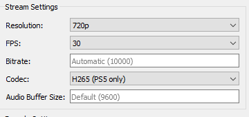
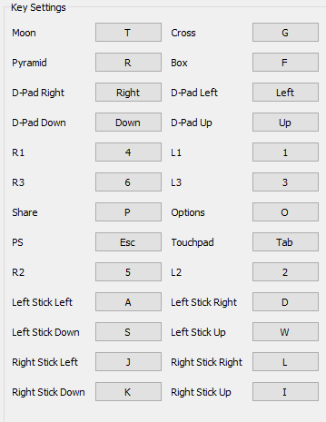
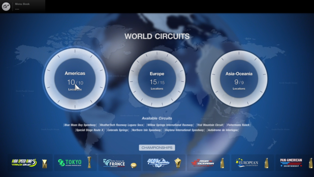
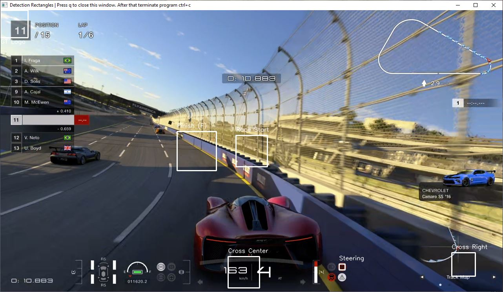

# About
First of all this was never setup to be a portable solution that would work on any configuration. The way it's setup works good for my setup. It may not work for you out of the box. If you have no programming knowledge it maybe be difficult to get it working. I've only tested this in combination with PS5 it may or may not work correctly with PS4 or just may need some tuning for the sleep values considering loadtimes will be very different. The code is just slapt together really quickly so don't hate me for it :p I hope this helps you get started by experimenting yourself with how you can automate things by just using screendata. Anyone is free to use this code however they like, no credit is needed. This will only run on Windows.

Also don't forget to check out alternatives like Septomor's driving script:
https://forum.psnprofiles.com/topic/124003-afk-methods-for-farming/

# Binary Build
If you don't want to go to the trouble of installing python you can download the release build at the release page. https://github.com/aimerror/granturismo/releases

This will be a pretty beefy filesize but should work just as well. This will ofcourse still require you to install Chiaki Remote play.

# Remote play setup
The script works in combination with the Chiaki remote play client.
https://git.sr.ht/~thestr4ng3r/chiaki/refs/v2.1.1

You need to setup your video stream setting as followed:
The framerate is not really important but it is import to run it at 720p.

The input keys need to be setup like this:

# Car and Assistance
* Camera: 3rd person follow cam
* Car: Tomhawk S VGT (other cars will probably be fine)
* Transmission: AT
* TC: 5
* ASM: ON
* Countersteering: Strong (this is important. The script check if the icon is white then we are probably on the straight and it will try to steer to the right to hug the wall. When it's red we are probably in a corner and don't want to be steering anymore. This is highly experimental but works pretty good for my setup.

# Python
I'm currently running python 3.10.1 with pip 21.2.5. The following project dependancies need to be installed.
* ~~ahk                0.13.0~~
* ~~mss                6.1.0~~
* numpy              1.22.0
* opencv-python      4.5.5.62
* pywin32            303
* pynput             1.7.6 (only for screenshot.py)

~~Also make sure you got ahk installed. You can download it here https://www.autohotkey.com/~~

# How to run
Make sure chiaki is running and that you are on the world selection screen. And just open powershell and run "python gran_turismo.py".
Do not resize the stream window. You can move the window but don't move it offscreen or minimize it. 
You can put other windows on top of it and it "should" still work fine. Doing other stuff can potentially cause artifacts in the stream for
some reason. So it could have a negative impact on the image recognitions logic.
After starting the script it should start selecting the pan american championship and start the race. To stop the script just go to your terminal/powershell and ctrl+c ;-)
If the car is not steering or it steering to much open config.py file and adjust the value. Lowering the value will make the car steer more agressive.
You can display the similarity value if you turn debug in the config to True which will hopefully make finetuning a bit easier.

# How it works
It will check if Chiaki is running check window_info.py and it will set focus to chiaki after you start the script.
Simple menu selections will be done by just pressing d-pad keys a number of times.
For screens where the x icon is visible it will always wait till it is visible and then press the button. 
After the button is clicked to start the race it will just wait a number of seconds and just press the throttle and nitro button.
It will check the countersteering icon to see if we are on the straight or in a corner.
To check if the race is finished it will check for the letter F in the word "FINISH" if your game is not english this may cause issues.
After that it should automaticly click through all the screens and exit out the championship.
It will check the upper left icon to see if we arrived back at the world circuit screen.

(if some image comparisons don't work on your setup you may need to replace the assets in the assets folder. I added a screenshot script which you
can start with "python screenshot.py" and press ']' to take a screenshot. It will only grab the remote play stream. This way you can also easily check the coordinates in gimp to setup the detection rectangles in the code.

Also check the debug_rects window to see if everything lines up correctly. You can get this by setting SHOW_DETECTION_RECT_DEBUG to True. It should look like this.

